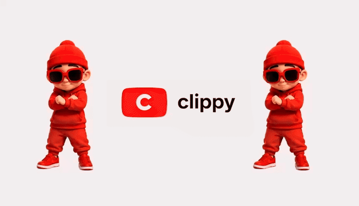

<p align="center">
  
</p>

# Clippy

[](LICENSE)
[](web/)
[](worker/)
[](web/)
[](docs/SETUP.md)
[](https://github.com/Suneelvarma5fi/clippy/pulls)

Turn long YouTube videos into short, captioned, face-tracked clips — on your own machine, with your own API keys.

Paste a YouTube URL. Clippy transcribes it, finds the moments worth clipping, reframes them to portrait around the speaker's face, burns in animated captions, and hands you MP4s ready to post.

## Features

- **AI clip finding** — a multi-stage LLM pipeline (scout → craft → rank) picks self-contained moments with a hook, not just loud bits. Clips can splice non-adjacent segments.
- **Face-tracked reframing** — 9:16, 4:5, 1:1 or 16:9, with the crop following the active speaker.
- **Captions** — six styles: four animated (Pill, Impact, Beast, Karaoke) rendered with HyperFrames, two static (Clean, Box). Word-level timing from WhisperX.
- **Stickers & templates** — text and image (logo) overlays; save brand presets and apply them across clips.
- **Two-phase rendering** — the expensive face-tracked cut is cached; restyling captions or stickers is a cheap second pass.
- **Library, collections, bulk export, social copy** — organise sources, export many clips at once, generate post text per clip.
- **Single-user by default** — no accounts, no sign-in. Multi-user Clerk auth is a one-line opt-in for hosted deployments.

## What you need

Four accounts. Only the last two cost money, and only when you process a video.

| | Used for | Cost |
|---|---|---|
| [Supabase](https://supabase.com) | Database | Free tier |
| [Cloudflare R2](https://www.cloudflare.com/developer-platform/r2/) | Media storage (any S3 bucket works) | Free tier — 10 GB |
| [OpenRouter](https://openrouter.ai) | Clip identification, social copy | Pay per use |
| [Replicate](https://replicate.com) | WhisperX transcription (GPU) | Pay per use |

Locally: **Node 20+**, **Python 3.12**, **ffmpeg**. On Windows, run the worker in Docker (`docker compose up`) instead of installing its native dependencies — see [Known limitations](#known-limitations).

Clippy runs on your machine but is not offline — it needs those services.

## Quick start

The full walkthrough with a checkpoint after every step is in **[docs/SETUP.md](docs/SETUP.md)**. If you're using an AI agent to set this up, point it there.

The short version:

```bash
# 1. Accounts: create a Supabase project and apply supabase/migrations/*.sql
#    in order; create an R2 bucket named "clippy" with an API token;
#    get an OpenRouter key and a Replicate token.

# 2. Env files
cp web/.env.local.example web/.env.local
cp worker/.env.example    worker/.env
#    Fill both in. WORKER_SECRET must match across the two.

# 3. Worker (native)
cd worker
python3.12 -m venv .venv && .venv/bin/pip install -r requirements.txt
.venv/bin/python -m spacy download en_core_web_sm
.venv/bin/uvicorn main:app --port 8000
#    ...or on Windows / to skip native deps:  docker compose up --build

# 4. Web
cd web && npm install && npm run dev      # http://localhost:3000
```

The worker refuses to start if any required variable or binary is missing and tells you exactly which.

## Known limitations

Worth reading before you rely on it.

- **Face tracking is audio-driven.** Who's on screen is decided by *who is speaking* (diarisation) plus face recognition to find that person. It does not watch mouths. So it can miss the speaker when recognition is weak — a face in near-profile, or heavy blur — and it can't help solo narration over B-roll, where the speaker is never on screen. It works best on interviews, podcasts and panels with consistent participants. The obvious next improvement is a visual mouth-movement signal from InsightFace's landmark model; contributions welcome.
- **Speaker-aware tracking needs `HUGGINGFACE_TOKEN`.** Without it there's no diarisation, and the tracker falls back to following the largest face.
- **Storage must allow large files.** Cloudflare R2 is the documented default. Supabase Storage works only on the Pro plan — its free plan caps files at 50 MB, and a source video is hundreds of MB.
- **Sources are kept at YouTube's best quality** (often 4K, ~800 MB per 20 minutes) because the portrait crop is cut from them. That's ~a dozen videos on R2's free 10 GB; delete finished ones from the Library, or enable `DAILY_CLEANUP_ENABLED`.
- **Windows runs the worker in Docker.** The image builds ffmpeg, Node, a headless Chrome and the ML stack, and hasn't yet been built by the maintainers on a Windows machine — if you're first, please open an issue with the result either way.
- **"weak" clips.** Moments the Scout flagged but the Crafter couldn't make self-contained are kept and labelled `weak`, with the reason on hover, rather than hidden. Expect several per video; they're there for you to judge.

## Architecture

```
Browser ──▶ Next.js (web/)  ──▶ Supabase Postgres      (videos, clips, jobs, exports)
                │                Cloudflare R2         (all media, S3 protocol)
                └──▶ Python worker (worker/, FastAPI)
                         ├─ yt-dlp        download source
                         ├─ Replicate     WhisperX transcription
                         ├─ OpenRouter    clip identification
                         ├─ InsightFace   face tracking
                         ├─ HyperFrames   animated captions (headless Chrome)
                         └─ ffmpeg        cutting, reframing, encoding
```

The web app queues jobs in Postgres and calls the worker over HTTP with a shared secret. The worker also polls for queued jobs, so a crash mid-job is recovered on restart.

## Development

```bash
cd web    && npm test                      # vitest
cd worker && .venv/bin/python test_units.py   # one file per area; all plain-assert
```

`CLAUDE.md` holds the engineering guidelines. The web app is Next.js 16 — read `web/AGENTS.md` before writing code there.

## License

[MIT](LICENSE)
